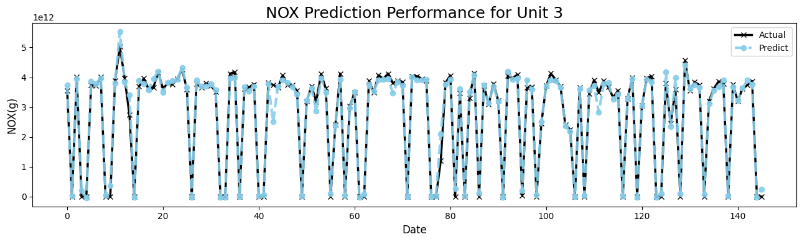
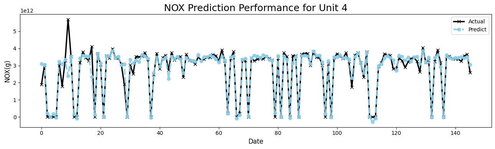
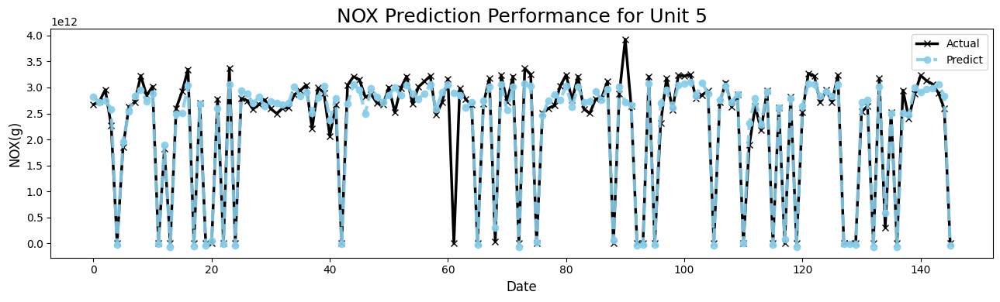
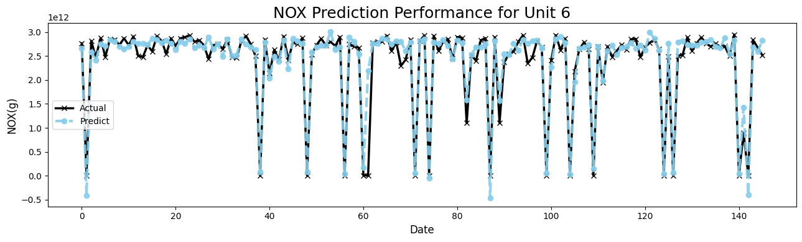
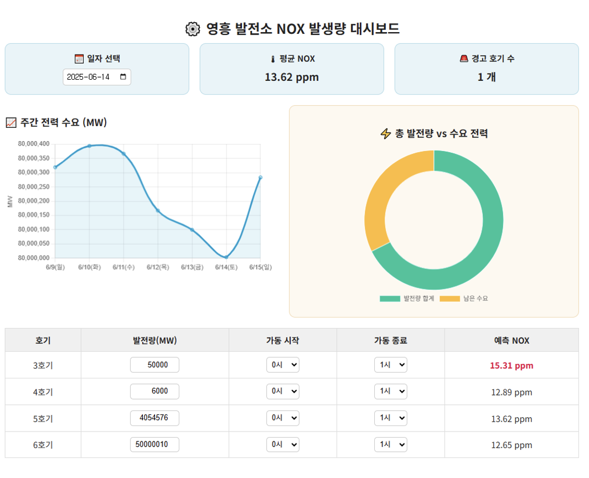

# NOXTURN: Power Plant NOx Emission Prediction

### Background

* With rising electricity demand, emissions are also increasing, highlighting the need for effective reduction strategies.
* Nitrogen oxides (NOx) is a major contributor to fine dust, crop damage, and acid rain, negatively impacting public health and industrial activities.
* The emission sources in the energy sector are clearly identifiable and can be directly regulated through policy.
* Targeted power plant is planning to be equipped with a digital operating system, and has consistently been listed among the top NOx-emitting facilities.

### Project Objective & Expected Outcome
 
* Provide a low-cost and practical model using only public external data without internal sensored-data
* Develop a predictive system to forecast emissions and support proactive strategy formulation
* Digitize and preserve the expertise of veteran operators in order to solve knowledge transfer difficulty due to high turnover among younger employees
* Serve as a pilot tool for training new employees and for on-site validation

---

### Dataset

* **Korea South-East Power Plant Data (KOEN)**
  * Analyze NOx status and emission patterns
  * Train model for NOx prediction
  * Data Files: `Daily average ambient concentration`, `Daily average weather information`, `Daily average pollutant emissions`, `Hourly power generation records`
  * Key Variables: `Power generation (MW)`, `Flow`, `O₂`, `Temperature`, `Humidity`, `Wind speed`, `Operating hours and idle hours`, `NOx`
* **Korea Power Exchange Data**
  * Estimate expected production contribution of Korea South-East Power plants compared to national electricity demand
  * Use plant-level electricity trading volume data to evaluate contribution to the power market
  * Data Files: `Hourly national electricity demand`, `Plant-level electricity trading volumes`
  * Key Variables: `Hourly nationwide demand data`, `Monthly electricity trading volume by plant` 
* **KMA:** `Temperature`, `humidity`, `wind` (for missing values)
    
### Workload

1. **Project Planning and Data Collection**

    * Project Goal & Problem Definition
    * Research on Environmental Regulations and NOx Management
    * Data Collection
    * Defining Data Requirements

2. **Data Preprocessing and Exploratory Data Analysis (EDA)**

   * Exploratory Data Analysis (EDA)
   * Visual Insights Extraction
   * Preprocessing
   * Variable Definition

3. **Model Development and Evaluation**

   * Training Strategy and Model Design
   * Baseline Model Development
   * Performance Metric Calculation & Optimization
   * Final Model Selection

4. **Project Outcome and Presentation**

   * Summarizing Analysis Results and Extracting Implications
   * Organizing Utilization Strategies
   * PPT Creation and Visual Material Preparation

### Main Tasks

> **Mainly responsible for Research on Environmental Regulations and NOx Management, EDA, Visual Insights Extraction, and Model Development and Evaluation**

### Key Contributions

* **Time-Series Analysis:** ACF (4-day autocorrelation), lag features
* Convert NOx data in ppm to grams (g)
  * `NOx (g) = NOx (ppm) × 1.308 × Flow / 1e-3`
  * `O₂ (g) = O₂ (ppm) × 1.308 × Flow / 1e-3`
* Modeling: `XGBoostRegressor`

### 📈 Results

| Unit |  RMSE  | R²   |
| ---- | -------- | ---- |
| 3    | 504.52   | 0.90 |
| 4    | 492.65   | 0.85 |
| 5    | 219.48   | 0.93 |
| 6    | 282.72   | 0.92 |

---

### Web Service Demonstration

